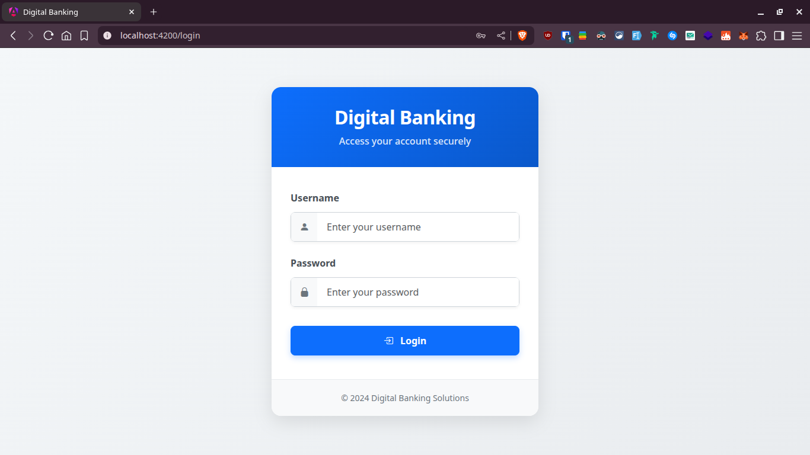
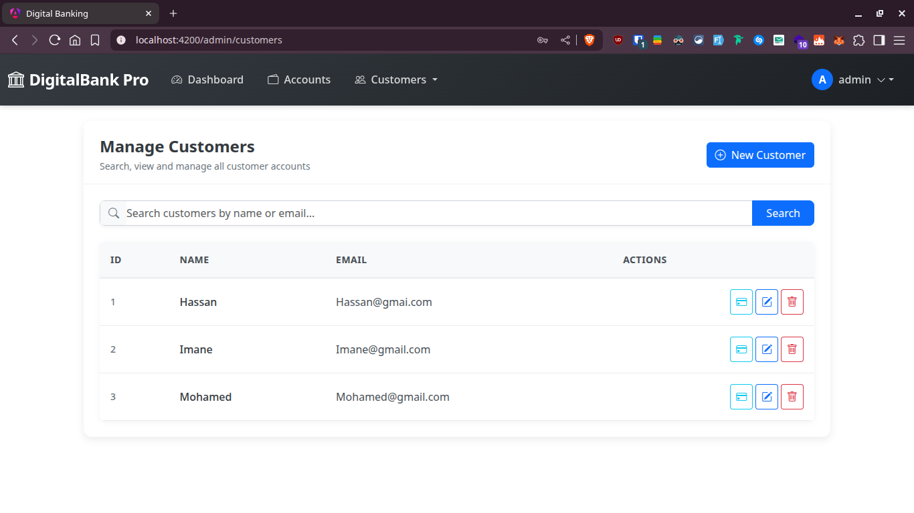
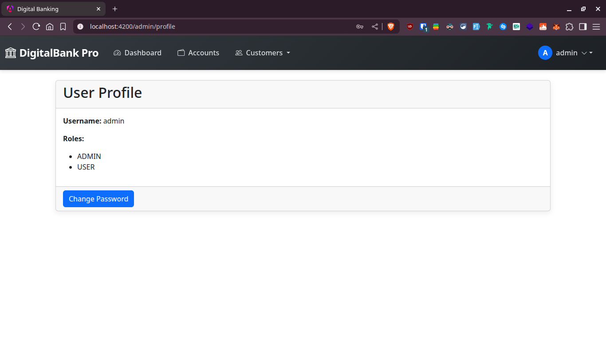

# Digital Banking Application

## Introduction

This project is a comprehensive Digital Banking Application developed as part of the Architecture JEE and Distributed Systems course at ENSET. The application implements a modern banking system with a secure Spring Boot backend and an Angular frontend. 

The Digital Banking Application allows bank administrators to manage customers and their accounts (current and savings), perform various banking operations such as credit, debit, and transfers, and provides customers with access to their account information and transaction history.

The project demonstrates the implementation of several advanced concepts including:
- Secure API development with JWT and OAuth2
- Frontend development with Angular 19
- Responsive UI design with Bootstrap
- Data persistence with JPA and MariaDB
- Proper separation of concerns using DTO pattern

## Table of Contents

1. [Project Objectives](#project-objectives)
2. [Backend Implementation](#backend-implementation)
   - [Project Structure](#backend-structure)
   - [Domain Model](#domain-model)
   - [Service Layer](#service-layer)
   - [REST Controllers](#rest-controllers)
   - [Security Implementation](#security-implementation)
3. [Frontend Implementation](#frontend-implementation)
   - [Project Structure](#frontend-structure)
   - [Components](#components)
   - [Services](#frontend-services)
   - [Guards and Interceptors](#guards-and-interceptors)
4. [Application Screenshots](#application-screenshots)
5. [Project Structure](#project-structure)
6. [Running the Application](#running-the-application)
7. [Conclusion](#conclusion)

## Project Objectives

The main objectives of this project are:

1. Develop a secure banking application with proper user authentication and authorization
2. Implement CRUD operations for customers and bank accounts
3. Enable banking operations (credit, debit, transfers)
4. Create a responsive and intuitive user interface
5. Apply best practices in software architecture and design patterns
6. Properly separate concerns between the presentation, business, and data access layers
7. Implement proper error handling and validation

## Backend Implementation

The backend of the Digital Banking Application is built using Spring Boot, providing a robust and scalable architecture. It follows a layered architecture pattern with clear separation of concerns.

### Backend Structure

The backend is organized into the following packages:

- `entities`: Contains JPA entities representing the domain model
- `repositories`: Spring Data JPA repositories for database access
- `services`: Business logic layer with service interfaces and implementations
- `dtos`: Data Transfer Objects for communication with the frontend
- `mappers`: Mappers for converting between entities and DTOs
- `controllers`: REST API controllers exposing endpoints
- `exceptions`: Custom exceptions and global exception handling
- `security`: Security configuration and JWT authentication

### Domain Model

The domain model is represented by the following entities:

```java
@Entity
@Data @NoArgsConstructor @AllArgsConstructor
public class Customer {
    @Id
    @GeneratedValue(strategy = GenerationType.IDENTITY)
    private Long id;
    private String name;
    private String email;
    @OneToMany(mappedBy = "customer")
    private List<BankAccount> bankAccounts;
}

@Entity
@Data @NoArgsConstructor @AllArgsConstructor
@Inheritance(strategy = InheritanceType.SINGLE_TABLE)
@DiscriminatorColumn(name = "TYPE", length = 4)
public abstract class BankAccount {
    @Id
    private String id;
    private double balance;
    private Date createdAt;
    @Enumerated(EnumType.STRING)
    private AccountStatus status;
    @ManyToOne
    private Customer customer;
    @OneToMany(mappedBy = "bankAccount")
    private List<AccountOperation> accountOperations;
}

@Entity
@DiscriminatorValue("CURR")
@Data @NoArgsConstructor @AllArgsConstructor
public class CurrentAccount extends BankAccount {
    private double overDraft;
}

@Entity
@DiscriminatorValue("SAV")
@Data @NoArgsConstructor @AllArgsConstructor
public class SavingAccount extends BankAccount {
    private double interestRate;
}

@Entity
@Data @NoArgsConstructor @AllArgsConstructor
public class AccountOperation {
    @Id
    @GeneratedValue(strategy = GenerationType.IDENTITY)
    private Long id;
    private Date operationDate;
    private double amount;
    @Enumerated(EnumType.STRING)
    private OperationType type;
    private String description;
    @ManyToOne
    private BankAccount bankAccount;
}

public enum OperationType {
    DEBIT, CREDIT
}

public enum AccountStatus {
    CREATED, ACTIVATED, SUSPENDED
}
```

This model represents a banking system where:
- A Customer can have multiple BankAccounts (one-to-many relationship)
- BankAccount is an abstract class with two concrete implementations: CurrentAccount and SavingAccount
- Each BankAccount can have multiple AccountOperations (one-to-many relationship)
- AccountOperations represent transactions on the account (debit or credit)

The inheritance strategy `InheritanceType.SINGLE_TABLE` means that all account types are stored in a single database table with a discriminator column (`TYPE`) to identify the account type. This approach provides better performance for polymorphic queries at the cost of having nullable columns for type-specific attributes.

The `@Data`, `@NoArgsConstructor`, and `@AllArgsConstructor` are Lombok annotations that automatically generate getters, setters, constructors, equals, hashCode, and toString methods, significantly reducing boilerplate code.

The `@OneToMany` and `@ManyToOne` annotations define bidirectional relationships between entities, with the `mappedBy` attribute specifying the field that owns the relationship.

### Data Transfer Objects (DTOs)

The application uses the DTO pattern to separate the internal domain model from the data exposed to clients. This provides several benefits:

```java
@Data
public class CustomerDTO {
    private Long id;
    private String name;
    private String email;
}

@Data
public abstract class BankAccountDTO {
    private String id;
    private double balance;
    private Date createdAt;
    private AccountStatus status;
    private CustomerDTO customerDTO;
    private String type;
}

@Data
public class CurrentBankAccountDTO extends BankAccountDTO {
    private double overDraft;
}

@Data
public class SavingBankAccountDTO extends BankAccountDTO {
    private double interestRate;
}

@Data
public class AccountOperationDTO {
    private Long id;
    private Date operationDate;
    private double amount;
    private OperationType type;
    private String description;
}

@Data
public class AccountHistoryDTO {
    private String accountId;
    private double balance;
    private int currentPage;
    private int totalPages;
    private int pageSize;
    private List<AccountOperationDTO> accountOperationDTOS;
}
```

Using DTOs allows us to:

1. Hide internal implementation details from clients
2. Customize data representation for specific use cases
3. Prevent circular references during JSON serialization
4. Control the exposure of sensitive data
5. Version the API independently from the domain model

The mappers convert between entities and DTOs:

```java
@Service
public class BankAccountMapperImpl implements BankAccountMapper {
    @Override
    public CustomerDTO fromCustomer(Customer customer) {
        CustomerDTO customerDTO = new CustomerDTO();
        customerDTO.setId(customer.getId());
        customerDTO.setName(customer.getName());
        customerDTO.setEmail(customer.getEmail());
        return customerDTO;
    }

    @Override
    public Customer fromCustomerDTO(CustomerDTO customerDTO) {
        Customer customer = new Customer();
        customer.setId(customerDTO.getId());
        customer.setName(customerDTO.getName());
        customer.setEmail(customerDTO.getEmail());
        return customer;
    }

    @Override
    public SavingBankAccountDTO fromSavingBankAccount(SavingAccount savingAccount) {
        SavingBankAccountDTO savingBankAccountDTO = new SavingBankAccountDTO();
        savingBankAccountDTO.setId(savingAccount.getId());
        savingBankAccountDTO.setBalance(savingAccount.getBalance());
        savingBankAccountDTO.setCreatedAt(savingAccount.getCreatedAt());
        savingBankAccountDTO.setStatus(savingAccount.getStatus());
        savingBankAccountDTO.setCustomerDTO(fromCustomer(savingAccount.getCustomer()));
        savingBankAccountDTO.setInterestRate(savingAccount.getInterestRate());
        savingBankAccountDTO.setType("SavingAccount");
        return savingBankAccountDTO;
    }

    // More mapper methods...
}
```

### Service Layer Implementation

The service layer contains the business logic of the application. The `BankAccountServiceImpl` class implements the `BankAccountService` interface:

```java
@Service
@Transactional
@AllArgsConstructor
@Slf4j
public class BankAccountServiceImpl implements BankAccountService {
    private CustomerRepository customerRepository;
    private BankAccountRepository bankAccountRepository;
    private AccountOperationRepository accountOperationRepository;
    private BankAccountMapper bankAccountMapper;
    private DashboardRepository dashboardRepository;

    @Override
    public CustomerDTO saveCustomer(CustomerDTO customerDTO) {
        log.info("Saving new Customer");
        Customer customer = bankAccountMapper.fromCustomerDTO(customerDTO);
        Customer savedCustomer = customerRepository.save(customer);
        return bankAccountMapper.fromCustomer(savedCustomer);
    }

    @Override
    public CurrentBankAccountDTO saveCurrentBankAccount(double initialBalance, double overDraft, Long customerId) throws CustomerNotFoundException {
        Customer customer = customerRepository.findById(customerId)
                .orElseThrow(() -> new CustomerNotFoundException("Customer not found"));
        
        CurrentAccount currentAccount = new CurrentAccount();
        currentAccount.setId(UUID.randomUUID().toString());
        currentAccount.setCreatedAt(new Date());
        currentAccount.setBalance(initialBalance);
        currentAccount.setOverDraft(overDraft);
        currentAccount.setCustomer(customer);
        currentAccount.setStatus(AccountStatus.CREATED);
        
        CurrentAccount savedBankAccount = bankAccountRepository.save(currentAccount);
        return bankAccountMapper.fromCurrentBankAccount(savedBankAccount);
    }

    @Override
    public void debit(String accountId, double amount, String description) throws BankAccountNotFoundException, BalanceNotSufficientException {
        BankAccount bankAccount = bankAccountRepository.findById(accountId)
                .orElseThrow(() -> new BankAccountNotFoundException("Bank account not found"));
        
        if (bankAccount.getBalance() < amount) {
            throw new BalanceNotSufficientException("Balance not sufficient");
        }
        
        AccountOperation accountOperation = new AccountOperation();
        accountOperation.setType(OperationType.DEBIT);
        accountOperation.setAmount(amount);
        accountOperation.setDescription(description);
        accountOperation.setOperationDate(new Date());
        accountOperation.setBankAccount(bankAccount);
        accountOperationRepository.save(accountOperation);
        
        bankAccount.setBalance(bankAccount.getBalance() - amount);
        bankAccountRepository.save(bankAccount);
    }

    @Override
    public void transfer(String accountIdSource, String accountIdDestination, double amount) throws BankAccountNotFoundException, BalanceNotSufficientException {
        debit(accountIdSource, amount, "Transfer to " + accountIdDestination);
        credit(accountIdDestination, amount, "Transfer from " + accountIdSource);
    }

    // More service methods...
}
```

The `@Transactional` annotation ensures that all operations within a method are executed within a transaction. If an exception occurs, all database changes are rolled back. This is crucial for maintaining data consistency, especially for operations like transfers.

The `@Slf4j` annotation from Lombok automatically creates a logger field, allowing for easy logging throughout the class.

The class uses constructor dependency injection (facilitated by `@AllArgsConstructor`) to inject all required dependencies, following the Spring recommended approach for dependency injection.

Key business logic features include:
- UUID generation for account IDs
- Transaction rollback for failed operations
- Proper validation before operations (e.g., checking balance before debit)
- Clear separation between entity and DTO handling

### REST Controllers Implementation

The application exposes RESTful APIs through various controllers with security annotations:

```java
@RestController
@RequestMapping("/accounts")
@AllArgsConstructor
public class BankAccountRestAPI {
    private BankAccountService bankAccountService;

    @GetMapping("/{accountId}")
    public BankAccountDTO getBankAccount(@PathVariable String accountId) throws BankAccountNotFoundException {
        return bankAccountService.getBankAccount(accountId);
    }
    
    @GetMapping()
    @PreAuthorize("hasAuthority('SCOPE_USER') or hasAuthority('SCOPE_ADMIN')")
    public List<BankAccountDTO> listAccounts(){
        return bankAccountService.bankAccountList();
    }
    
    @GetMapping("/{accountId}/pageOperations")
    @PreAuthorize("hasAuthority('SCOPE_USER') or hasAuthority('SCOPE_ADMIN')")
    public AccountHistoryDTO getAccountHistory(
            @PathVariable String accountId,
            @RequestParam(name="page",defaultValue = "0") int page,
            @RequestParam(name="size",defaultValue = "5")int size) throws BankAccountNotFoundException {
        return bankAccountService.getAccountHistory(accountId,page,size);
    }

    @PostMapping("/debit")
    @PreAuthorize("hasAuthority('SCOPE_ADMIN')")
    public DebitDTO debit(@RequestBody DebitDTO debitDTO) throws BankAccountNotFoundException, BalanceNotSufficientException {
        this.bankAccountService.debit(debitDTO.getAccountId(),debitDTO.getAmount(),debitDTO.getDescription());
        return debitDTO;
    }
    
    // More controller methods...
}
```

The controllers follow REST principles:
- HTTP verbs (`GET`, `POST`, `PUT`, `DELETE`) match their semantic meaning
- URI paths are structured around resources
- Request parameters and path variables are used appropriately
- Response status codes reflect operation outcomes

The `@PreAuthorize` annotations implement method-level security, ensuring that only users with specific authorities can access certain endpoints. This is part of Spring Security's expression-based access control.

Error handling is implemented through exception classes that are mapped to HTTP status codes:

```java
@RestControllerAdvice
public class GlobalExceptionHandler {
    @ExceptionHandler(CustomerNotFoundException.class)
    public ResponseEntity<ErrorResponse> handleCustomerNotFoundException(CustomerNotFoundException ex) {
        ErrorResponse errorResponse = new ErrorResponse(HttpStatus.NOT_FOUND.value(), ex.getMessage());
        return new ResponseEntity<>(errorResponse, HttpStatus.NOT_FOUND);
    }
    
    @ExceptionHandler(BankAccountNotFoundException.class)
    public ResponseEntity<ErrorResponse> handleBankAccountNotFoundException(BankAccountNotFoundException ex) {
        ErrorResponse errorResponse = new ErrorResponse(HttpStatus.NOT_FOUND.value(), ex.getMessage());
        return new ResponseEntity<>(errorResponse, HttpStatus.NOT_FOUND);
    }
    
    @ExceptionHandler(BalanceNotSufficientException.class)
    public ResponseEntity<ErrorResponse> handleBalanceNotSufficientException(BalanceNotSufficientException ex) {
        ErrorResponse errorResponse = new ErrorResponse(HttpStatus.BAD_REQUEST.value(), ex.getMessage());
        return new ResponseEntity<>(errorResponse, HttpStatus.BAD_REQUEST);
    }
}
```

### Security Implementation with OAuth2 and JWT

The application implements a robust security system using OAuth2 and JWT (JSON Web Tokens) through Spring Security. This modern approach provides several advantages over traditional session-based authentication:

1. **Stateless Architecture**: No server-side session storage required
2. **Cross-Domain Authentication**: Tokens work across different domains/services
3. **Mobile/API Friendly**: Ideal for RESTful APIs and mobile applications
4. **Performance**: Reduced database lookups for authentication checks
5. **Scalability**: Easier to scale horizontally without shared session stores

The security configuration is implemented as follows:

```java
@Configuration
@EnableWebSecurity
@EnableMethodSecurity(prePostEnabled = true)
@AllArgsConstructor
public class SecurityConfig {
    private RsaKeyProperties rsaKeys;

    @Bean
    public SecurityFilterChain securityFilterChain(HttpSecurity http) throws Exception {
        return http
                .csrf(csrf -> csrf.disable())  // Disable CSRF for REST APIs
                .authorizeHttpRequests(ar -> ar.requestMatchers("/auth/**").permitAll())  // Public endpoints
                .authorizeHttpRequests(ar -> ar.anyRequest().authenticated())  // All other endpoints require authentication
                .oauth2ResourceServer(OAuth2ResourceServerConfigurer::jwt)  // Configure as OAuth2 resource server with JWT
                .sessionManagement(session -> session.sessionCreationPolicy(SessionCreationPolicy.STATELESS))  // No sessions
                .httpBasic(Customizer.withDefaults())  // Support basic auth
                .build();
    }

    @Bean
    JwtDecoder jwtDecoder() {
        return NimbusJwtDecoder.withPublicKey(rsaKeys.publicKey()).build();
    }

    @Bean
    JwtEncoder jwtEncoder() {
        JWK jwk = new RSAKey.Builder(rsaKeys.publicKey()).privateKey(rsaKeys.privateKey()).build();
        JWKSource<SecurityContext> jwks = new ImmutableJWKSet<>(new JWKSet(jwk));
        return new NimbusJwtEncoder(jwks);
    }
}
```

Key aspects of this security implementation:

1. **CSRF Protection**: CSRF is disabled because JWT tokens provide protection against these attacks when properly implemented
2. **Public Endpoints**: The `/auth/**` endpoints are accessible without authentication for login/registration
3. **Resource Server Configuration**: The application is configured as an OAuth2 resource server that validates JWT tokens
4. **Stateless Sessions**: No server-side session state is maintained, improving scalability
5. **RSA Key Pair**: Asymmetric cryptography (public/private key) is used for secure token signing and validation
6. **Method Security**: `@EnableMethodSecurity` enables annotation-based security at the method level with `@PreAuthorize`

The authentication controller manages user authentication, token generation, and registration:

```java
@RestController
@RequestMapping("/auth")
@AllArgsConstructor
public class SecurityController {
    private PasswordEncoder passwordEncoder;
    private AuthenticationManager authenticationManager;
    private JwtEncoder jwtEncoder;
    private UserRepository userRepository;
    
    @GetMapping("/profile")
    public Authentication authentication(Authentication authentication) {
        // Returns the current authenticated user's details
        return authentication;
    }

    @PostMapping("/login")
    public Map<String, String> login(@RequestBody AuthRequest authRequest) {
        // Step 1: Authenticate the user against Spring Security
        Authentication authentication = authenticationManager.authenticate(
                new UsernamePasswordAuthenticationToken(
                        authRequest.getUsername(), 
                        authRequest.getPassword()));
        
        // Step 2: Prepare token parameters
        Instant now = Instant.now();
        long expiry = 3600L; // Token valid for 1 hour
        
        // Step 3: Extract user roles/authorities and join them as space-separated string
        String scope = authentication.getAuthorities().stream()
                .map(GrantedAuthority::getAuthority)
                .collect(Collectors.joining(" "));
        
        // Step 4: Build the JWT claims (payload)
        JwtClaimsSet claims = JwtClaimsSet.builder()
                .issuer("self")                  // Token issuer
                .issuedAt(now)                   // Token issue time
                .expiresAt(now.plusSeconds(expiry)) // Token expiration
                .subject(authentication.getName())  // User identifier
                .claim("scope", scope)           // User authorities/permissions
                .build();
        
        // Step 5: Encode the JWT token with our private key
        String token = jwtEncoder.encode(JwtEncoderParameters.from(claims)).getTokenValue();
        
        // Step 6: Return the token to the client
        return Map.of("access_token", token);
    }
    
    @PostMapping("/register")
    public AppUser register(@RequestBody RegistrationRequest registrationRequest) {
        // Step 1: Encode the password securely before storage
        String encodedPassword = passwordEncoder.encode(registrationRequest.getPassword());
        
        // Step 2: Create a new user entity
        AppUser appUser = new AppUser();
        appUser.setUsername(registrationRequest.getUsername());
        appUser.setPassword(encodedPassword);  // Store encoded password, not plain text
        appUser.setRoles(new ArrayList<>());
        
        // Step 3: Assign default role (USER) to new accounts
        AppRole role = AppRole.builder()
                .roleName("USER")
                .build();
        
        appUser.getRoles().add(role);
        
        // Step 4: Save user to database
        return userRepository.save(appUser);
    }
}
```

This implementation demonstrates several important security practices:

1. **Secure Authentication**: Uses Spring Security's `AuthenticationManager` to validate credentials
2. **JWT Token Structure**: 
   - **Issuer**: Identifies the system that issued the token
   - **Subject**: Contains the username/ID of the authenticated user
   - **Issued At**: Timestamp when the token was created
   - **Expiration**: When the token becomes invalid (1 hour in this case)
   - **Scope**: Contains user roles/permissions as space-separated values

3. **Password Security**: 
   - Passwords are never stored in plain text
   - Uses `PasswordEncoder` with bcrypt hashing algorithm
   - Password complexity and validation not shown here but would be in a production system

4. **User Registration Flow**:
   - Creates new user accounts with secure password storage
   - Assigns default role (USER) for proper authorization
   - In a production system, would include email verification

5. **Role-Based Access Control**:
   - User permissions are encoded in the JWT token
   - These roles are used by `@PreAuthorize` annotations to control access
   - Separates regular users from administrators

## Frontend Implementation

The frontend of the Digital Banking Application is developed using Angular 19, providing a modern and responsive user interface. It follows a component-based architecture and communicates with the backend via RESTful APIs.

### Frontend Structure

The frontend is organized into the following main folders:

- `app/components`: Contains Angular components
- `app/models`: TypeScript interfaces representing the data models
- `app/services`: Services for API communication
- `app/guards`: Route guards for authentication and authorization
- `app/interceptors`: HTTP interceptors for token management

### Components

The application consists of several key components, each with specific responsibilities following Angular's component-based architecture:

1. **Login Component**: Handles user authentication with form validation
   - Implements reactive forms with validation rules
   - Communicates with the AuthService for authentication
   - Manages authentication errors and user feedback
   - Redirects authenticated users to appropriate pages based on roles

2. **Dashboard Component**: Displays key statistics and metrics about the banking system
   - Uses Chart.js for visualization of account statistics and operations
   - Implements dynamic data loading with Observable pattern
   - Displays summary counts and KPIs in card layouts
   - Auto-refreshes data at configurable intervals

3. **Customers Component**: Lists all customers with search, pagination, and CRUD operations
   - Implements server-side pagination to handle large datasets efficiently
   - Provides real-time search functionality with debouncing
   - Conditionally displays action buttons based on user permissions
   - Handles optimistic UI updates for better user experience

4. **Customer-Accounts Component**: Shows accounts and operations for a specific customer
   - Displays customer details and all their associated accounts
   - Allows drilling down into account transactions history
   - Provides actions for account operations like credit, debit, and transfer
   - Implements tabbed interface for better organization of information

5. **Accounts Component**: Handles account operations (credit, debit, transfer) with forms
   - Implements modal dialogs for operation forms
   - Provides real-time validation of transaction amounts
   - Shows transaction history with filtering options
   - Handles error cases such as insufficient balance

6. **User-Profile Component**: Allows users to view and update their profile information
   - Displays user details and permissions
   - Provides form for updating personal information
   - Implements password change functionality with security validation
   - Shows login history and account activity

Each component is designed to handle a specific aspect of the application, promoting separation of concerns and reusability. The components communicate primarily through services, following the recommended Angular architecture patterns.

```typescript
@Component({
  selector: 'app-customers',
  templateUrl: './customers.component.html',
  styleUrl: './customers.component.css'
})
export class CustomersComponent implements OnInit {
  customers: Array<Customer> = [];
  errorMessage!: string;
  searchFormGroup!: FormGroup;
  currentPage: number = 0;
  size: number = 5;
  totalPages: number = 0;
  currentAction: string = "all";
  
  constructor(private customerService: CustomerService,
              private fb: FormBuilder,
              public authService: AuthService,
              private router: Router) {}
              
  ngOnInit(): void {
    this.searchFormGroup = this.fb.group({
      keyword: this.fb.control("")
    });
    this.handleGetPageCustomers();
  }
  
  handleGetPageCustomers() {
    this.customerService.getPageCustomers(this.currentPage, this.size)
      .subscribe({
        next: (data) => {
          this.customers = data.content;
          this.totalPages = data.totalPages;
        },
        error: (err) => {
          this.errorMessage = err;
        }
      });
  }
  
  handleGetAllCustomers() {
    this.customerService.getCustomers().subscribe({
      next: (data) => {
        this.customers = data;
      },
      error: (err) => {
        this.errorMessage = err;
      }
    });
  }
  
  handleSearchCustomers() {
    this.currentAction = "search";
    let keyword = this.searchFormGroup.value.keyword;
    this.customerService.searchCustomers(keyword).subscribe({
      next: (data) => {
        this.customers = data;
      },
      error: (err) => {
        this.errorMessage = err;
      }
    });
  }
  
  handleDeleteCustomer(customer: Customer) {
    let conf = confirm("Are you sure?");
    if (!conf) return;
    
    this.customerService.deleteCustomer(customer.id).subscribe({
      next: () => {
        // Remove the deleted customer from the list
        this.customers = this.customers.filter(c => c.id != customer.id);
      },
      error: (err) => {
        this.errorMessage = err;
      }
    });
  }
  
  handleCustomerAccounts(customer: Customer) {
    this.router.navigateByUrl("/customer-accounts/" + customer.id);
  }
  
  handleEditCustomer(customer: Customer) {
    this.router.navigateByUrl("/edit-customer/" + customer.id);
  }
}
```

The corresponding HTML template implements a responsive table with action buttons:

```html
<div class="container mt-2">
  <ng-container *ngIf="customers.length > 0; else noCustomers">
    <div class="card">
      <div class="card-header d-flex justify-content-between">
        <h3>Customers</h3>
        <div class="d-flex gap-2">
          <form [formGroup]="searchFormGroup" (ngSubmit)="handleSearchCustomers()">
            <div class="input-group">
              <input type="text" class="form-control" formControlName="keyword">
              <button class="btn btn-info">
                <i class="bi bi-search"></i>
              </button>
            </div>
          </form>
          <button *ngIf="authService.isAdmin" (click)="handleNewCustomer()" class="btn btn-info">
            <i class="bi bi-plus-circle"></i>
            New Customer
          </button>
        </div>
      </div>
      <div class="card-body">
        <table class="table table-hover">
          <thead>
            <tr>
              <th>ID</th>
              <th>Name</th>
              <th>Email</th>
              <th>Actions</th>
            </tr>
          </thead>
          <tbody>
            <tr *ngFor="let customer of customers">
              <td>{{customer.id}}</td>
              <td>{{customer.name}}</td>
              <td>{{customer.email}}</td>
              <td>
                <div class="d-flex gap-1">
                  <button (click)="handleCustomerAccounts(customer)" class="btn btn-info btn-sm">
                    Accounts
                  </button>
                  <button *ngIf="authService.isAdmin" (click)="handleEditCustomer(customer)" class="btn btn-warning btn-sm">
                    Edit
                  </button>
                  <button *ngIf="authService.isAdmin" (click)="handleDeleteCustomer(customer)" class="btn btn-danger btn-sm">
                    Delete
                  </button>
                </div>
              </td>
            </tr>
          </tbody>
        </table>
        <ul class="pagination">
          <li [ngClass]="currentPage==0 ? 'disabled page-item' : 'page-item'">
            <a (click)="gotoPage(currentPage-1)" class="page-link">&laquo;</a>
          </li>
          <li *ngFor="let item of [].constructor(totalPages); let i = index" 
              [ngClass]="i==currentPage ? 'active page-item' : 'page-item'">
            <a (click)="gotoPage(i)" class="page-link">{{i}}</a>
          </li>
          <li [ngClass]="currentPage==totalPages-1 ? 'disabled page-item' : 'page-item'">
            <a (click)="gotoPage(currentPage+1)" class="page-link">&raquo;</a>
          </li>
        </ul>
      </div>
    </div>
  </ng-container>
  <ng-template #noCustomers>
    <div class="alert alert-info" role="alert">
      No customers found.
    </div>
  </ng-template>
</div>
```

This template uses Angular directives like:
- `*ngFor` for iterating over collections
- `*ngIf` for conditional rendering
- `[ngClass]` for dynamic class binding
- Event binding with `(click)` and `(ngSubmit)`
- Property binding with `[formGroup]`
- Interpolation with `{{}}`

The component also implements pagination to handle large datasets efficiently.

### Frontend Services Implementation

Angular services encapsulate data access and business logic:

```typescript
@Injectable({
  providedIn: 'root'
})
export class CustomerService {
  constructor(private http: HttpClient) {}
  
  public getCustomers(): Observable<Array<Customer>> {
    return this.http.get<Array<Customer>>(`${environment.backendHost}/customers`);
  }
  
  public getPageCustomers(page: number, size: number): Observable<CustomerPage> {
    return this.http.get<CustomerPage>(`${environment.backendHost}/customers/page?page=${page}&size=${size}`);
  }
  
  public searchCustomers(keyword: string): Observable<Array<Customer>> {
    return this.http.get<Array<Customer>>(`${environment.backendHost}/customers/search?keyword=${keyword}`);
  }
  
  public saveCustomer(customer: Customer): Observable<Customer> {
    return this.http.post<Customer>(`${environment.backendHost}/customers`, customer);
  }
  
  public updateCustomer(customer: Customer): Observable<Customer> {
    return this.http.put<Customer>(`${environment.backendHost}/customers/${customer.id}`, customer);
  }
  
  public deleteCustomer(id: number): Observable<any> {
    return this.http.delete(`${environment.backendHost}/customers/${id}`);
  }
}
```

The `AuthService` manages authentication state and token handling:

```typescript
@Injectable({
  providedIn: 'root'
})
export class AuthService {
  private jwtToken: string = '';
  private roles: Array<any> = [];
  isAuthenticated: boolean = false;
  isAdmin: boolean = false;
  isUser: boolean = false;
  username: string = '';

  constructor(private http: HttpClient, private router: Router) {
    this.loadTokenFromLocalStorage();
  }

  public login(username: string, password: string): Observable<any> {
    return this.http.post<any>(`${environment.backendHost}/auth/login`, {
      username, password
    }).pipe(
      tap(response => {
        this.handleAuthentication(response);
      }),
      catchError(error => {
        this.isAuthenticated = false;
        return throwError(() => new Error(error.message));
      })
    );
  }

  private handleAuthentication(response: any): void {
    this.jwtToken = response.access_token;
    localStorage.setItem('access_token', this.jwtToken);
    const jwtHelper = new JwtDecode();
    const decodedJWT = jwtHelper.decode(this.jwtToken);
    this.username = decodedJWT.sub;
    this.roles = decodedJWT.scope.split(' ');
    this.isAuthenticated = true;
    this.isAdmin = this.roles.includes('ADMIN');
    this.isUser = this.roles.includes('USER');
  }

  public logout(): void {
    localStorage.removeItem('access_token');
    this.jwtToken = '';
    this.roles = [];
    this.isAuthenticated = false;
    this.isAdmin = false;
    this.isUser = false;
    this.username = '';
    this.router.navigateByUrl('/login');
  }

  public loadTokenFromLocalStorage(): void {
    const token = localStorage.getItem('access_token');
    if (token) {
      try {
        this.jwtToken = token;
        const jwtHelper = new JwtDecode();
        const decodedJWT = jwtHelper.decode(this.jwtToken);
        
        // Check if token is expired
        const expirationDate = new Date(decodedJWT.exp * 1000);
        if (expirationDate < new Date()) {
          this.logout();
          return;
        }
        
        this.username = decodedJWT.sub;
        this.roles = decodedJWT.scope.split(' ');
        this.isAuthenticated = true;
        this.isAdmin = this.roles.includes('ADMIN');
        this.isUser = this.roles.includes('USER');
      } catch (error) {
        this.logout();
      }
    }
  }

  public getToken(): string {
    return this.jwtToken;
  }
}
```

This service:
- Decodes JWT tokens to extract user information
- Handles token storage in localStorage for persistence across page reloads
- Provides role-based access control checks
- Automatically logs out users with expired tokens
- Manages the authentication state across the application

### HTTP Interceptors for Authentication

HTTP interceptors in Angular allow for global processing of HTTP requests and responses:

```typescript
@Injectable()
export class AuthInterceptor implements HttpInterceptor {
  constructor(private authService: AuthService, private router: Router) {}
  
  intercept(request: HttpRequest<any>, next: HttpHandler): Observable<HttpEvent<any>> {
    if (!request.url.includes('/auth/login')) {
      const token = this.authService.getToken();
      if (token) {
        // Clone the request and add the authorization header
        request = request.clone({
          setHeaders: {
            Authorization: `Bearer ${token}`
          }
        });
      }
    }
    
    // Pass the modified request to the next handler
    return next.handle(request).pipe(
      catchError((error: HttpErrorResponse) => {
        // Handle 401 Unauthorized errors
        if (error.status === 401) {
          this.authService.logout();
          this.router.navigateByUrl('/login');
        }
        
        // Pass the error to the component
        return throwError(() => error);
      })
    );
  }
}
```

This interceptor:
1. Automatically adds the JWT token to all requests (except login)
2. Handles 401 Unauthorized responses by logging out the user
3. Allows components to handle other types of errors

To register the interceptor, it's added to the application's config file:

```typescript
export const appConfig: ApplicationConfig = {
  providers: [
    provideZoneChangeDetection({ eventCoalescing: true }),
    provideRouter(routes),
    provideHttpClient(withInterceptors([appHttpInterceptor])),
    provideCharts(withDefaultRegisterables())
  ],
};

```

## Application Screenshots

Here are the main screens of the Digital Banking Application:

### Login Page


The login page provides secure authentication for users with username and password fields.

### Dashboard


The dashboard displays key statistics about customers, accounts, and operations.

### Customers List


The customers page lists all customers with options to search, add, edit, and delete customers.

### Add Customer


The add customer form allows administrators to create new customer records.

### Edit Customer


The edit customer form allows administrators to modify existing customer information.

### Customer Details and Accounts


This page shows customer details along with their accounts and provides options for different operations.

### Add Current Account


This form allows administrators to create a new current account for a customer.

### Add Savings Account


This form allows administrators to create a new savings account for a customer.

### Credit Operation


The credit form allows administrators to deposit money into a customer's account.

### Debit Operation


The debit form allows administrators to withdraw money from a customer's account.

### Transfer Operation


The transfer form allows administrators to transfer money between accounts.

### Account Search


This page allows searching for accounts and performing operations on them.

### User Profile


The user profile page displays the current user's information.

### Change Password


This form allows users to change their password securely.

## Project Structure

The Digital Banking Application has the following overall structure:

```
digital-banking/
├── backend/                 # Spring Boot Backend
│   ├── src/
│   │   ├── main/
│   │   │   ├── java/ma/enset/digitalbanking/
│   │   │   │   ├── controllers/    # REST API controllers
│   │   │   │   ├── dtos/           # Data Transfer Objects
│   │   │   │   ├── entities/       # JPA entities
│   │   │   │   ├── enums/          # Enumeration types
│   │   │   │   ├── exceptions/     # Exception classes
│   │   │   │   ├── mappers/        # Entity-DTO mappers
│   │   │   │   ├── repositories/   # Spring Data repositories
│   │   │   │   ├── security/       # Security configuration
│   │   │   │   ├── services/       # Business services
│   │   │   │   └── BackendApplication.java
│   │   │   └── resources/          # Configuration files
│   │   └── test/                   # Unit tests
│   └── pom.xml                     # Maven dependencies
│
├── frontend/                # Angular Frontend
│   ├── src/
│   │   ├── app/
│   │   │   ├── components/         # Angular components
│   │   │   │   ├── accounts/
│   │   │   │   ├── admin-template/
│   │   │   │   ├── change-password/
│   │   │   │   ├── customer-accounts/
│   │   │   │   ├── customers/
│   │   │   │   ├── dashboard/
│   │   │   │   ├── login/
│   │   │   │   ├── navbar/
│   │   │   │   ├── new-customer/
│   │   │   │   ├── not-authorized/
│   │   │   │   └── user-profile/
│   │   │   ├── guards/             # Route guards
│   │   │   ├── interceptors/       # HTTP interceptors
│   │   │   ├── model/              # TypeScript interfaces
│   │   │   ├── services/           # API services
│   │   │   └── app.routes.ts       # Application routes
│   │   └── assets/                 # Static assets
│   └── package.json                # NPM dependencies
│
└── screenshots/             # Application screenshots
```

## Running the Application

### Backend

To run the backend application:

1. Make sure you have Java 17 or higher installed
2. Make sure you have MariaDB installed and running
3. Navigate to the `backend` directory
4. Run the following command:

```bash
./mvnw spring-boot:run
```

The backend will start on port 8080 by default.

### Frontend

To run the frontend application:

1. Make sure you have Node.js and npm installed
2. Navigate to the `frontend` directory
3. Install dependencies:

```bash
npm install
```

4. Run the development server:

```bash
ng serve
```

The frontend will start on port 4200 by default.

## Conclusion

The Digital Banking Application demonstrates the integration of modern technologies to create a secure, scalable, and user-friendly banking system. The project successfully implements all the primary objectives, providing a robust solution for managing customers, accounts, and banking operations.

Key accomplishments in this project include:

1. Implementation of a secure authentication and authorization system using JWT and OAuth2
2. Development of a well-structured and maintainable codebase following best practices
3. Creation of a responsive and intuitive user interface with Angular
4. Proper handling of business logic and validations in both frontend and backend
5. Comprehensive error handling and user feedback mechanisms

This application could be extended in several ways, including:
- Adding more banking features such as scheduled transfers and payments
- Implementing internationalization for multiple languages
- Enhancing the dashboard with more detailed analytics
- Adding mobile application support using responsive design or native apps
- Implementing notifications for account activities

The project demonstrates the effective application of JEE architecture principles and distributed systems concepts in a real-world scenario.
